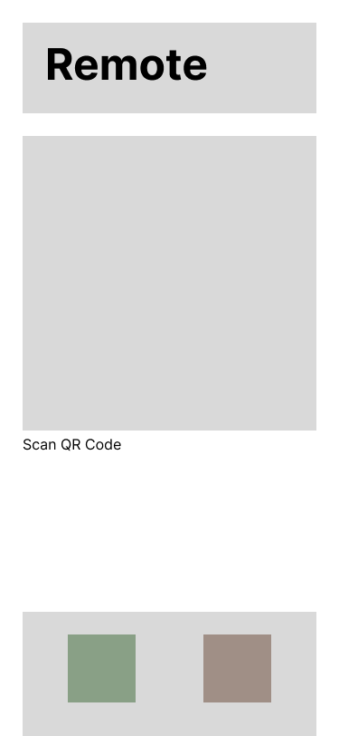
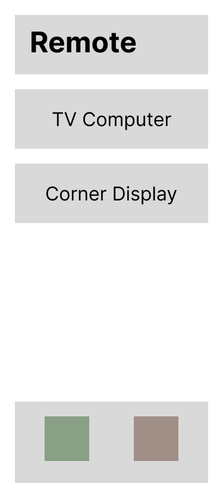
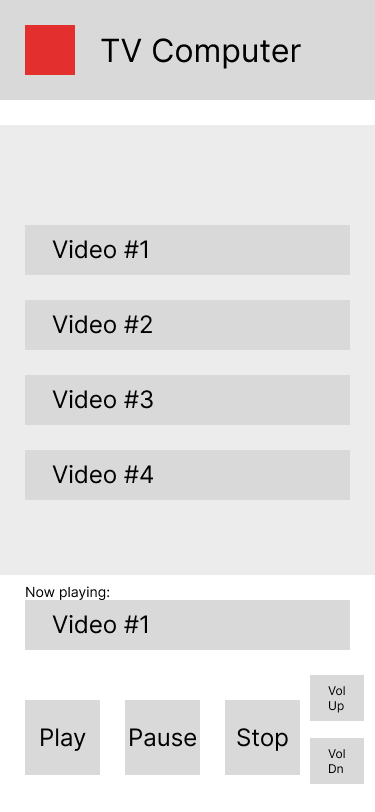

# Phones as Universal Remote Controls
**EEP523a Final Project Proposal**  
Tomas Perez-Rodriguez  

This project turns a single phone into a media control device that can manage playback of multiple network devices at the same time. The minimum viable product includes a media server application to play media on the host system, and a React Native application to remotely control the media playback.

## Topics Covered

* API: REST API to communicate between phone and media server
* Camera: QR Code Scanning Functionality
* GeoLocation: Location tracking to remember nearby servers

## Application Description

The mobile application will be implemented in two parts. A server will connect to a media player on the desktop computer, and expose a REST API for the mobile application to interact with. The application will use the camera and API to interact back with the server.

### Media Server

The media server will be a NodeJS web server application based on Express. It will expose a REST API with media control endpoints. These endpoints will allow clients to progamatically start playing media, stop playback, and adjust volume, as well as other media actions. To play media, the application will leverage the MPV media player via an API on the host.

### The Remote Control Application

The remote control application will serve as a client for the media server application. These are the key use cases:

* The user will be able to scan a QR Code to connect to the media server.
* The user will be able to select a video to play from a menu on the mobile application.
* The user will be able to pause, play, stop and change the volume from the phone.
* The media server will stop playback and return to the QR code screen when the remote is no longer around.

For QR code functionality, the app will use `react-native-qrcode-scanner` and `react-native-camera`. Once the application has a host URL, it will collect a playlist from the host. The screen will change to a playlist and playback control screen.

The most basic experience will show a list of movies to play available on the server. Once the user chooses one, the playback will begin, and the playback controls will be enabled in the phone.

While the application is open, it will keep in communication with the server keeping track of current playback state. This will be the cue for the server to continue playback or stop and return to the QR code screen.

In the media playback screen, the user will be able to return to the QR scanner page to connect to an additional server. If multiple servers have been connected, they will be shown on the QR code selection screen so the user doesn't have to scan QR codes to switch servers. The list of previously discovered servers will be filtered by geolocation: only servers within a few meters of the remote will be configurable by the application.

## Mobile User Interface

When the user starts the application, they are directed to the QR Code scanning page. In this page they can scan a QR code using the camera in the center of the display. If the application detects servers have been detected before nearby (using geolocation), the red button at the bottom takes them to the server selection page.

If the application knows of servers nearby, the application shows those servers in a list in the server selection page below. The user can press the green button to return to the QR Code scanning page.

Scanning a QR code, or tapping on a previously detected server, sends the user to the Remote page. The red button at the top of the screen sends the user back to the server 
selection page.

Selecting a movie from the list starts playback on the server. The play/pause/stop and volume buttons are enabled at this point, and each performs the respective server call.

## Anticipated technical challenges

* QR Code scanning functionality: While libraries exist for QR code scanning, compatibility issues may still arise.
* Disconnecting the application from the server: Need to define a mechanism to "end a session" when a phone goes away. Possibly a keep-alive mechanism, or using BLE if available to recognize the device. Adding a time slider to the app that regularly queries the server for current play time may be an interesting way to resolve this problem.
* Client authentication mechanism: The server may generate a token in the QR code and reject any requests from network clients that don't have this secret code. The token will have to be persisted on the server so clients can reconnect later.
* Need a scheme to store discovered displays by GPS coordinates. Will probably store as a simple list and display only those displays within a certain distance.
